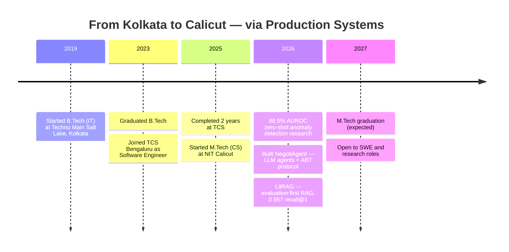

 

<picture>
  
</picture>

  

&nbsp;
&nbsp;
&nbsp;
&nbsp;
&nbsp;

  

&nbsp;
&nbsp;
&nbsp;

---

## &nbsp; About Me

I'm a **Software Engineer** with **2 years of production experience** at **Tata Consultancy Services**, currently pursuing an **M.Tech in Computer Science** at **NIT Calicut**.

I build high-performance backend systems for a living, dig into POSIX system calls for fun, and research Vision-Language Models for my thesis. I enjoy working at every layer — Java microservices, TCP sockets in C++, React frontends, and from-scratch neural networks.

- 🎓 **M.Tech CS** @ NIT Calicut *(Expected 2027)* &nbsp;·&nbsp; **B.Tech IT** @ Techno Main Salt Lake, Kolkata
- 💼 **Ex-TCS** — 2 years of enterprise Java/Spring Boot backend development
- ⚙️ Systems programmer — raw TCP sockets, `fork/exec`, `dup2`, multithreading in C++
- 🔬 Researcher — Multimodal Anomaly Detection with Vision-Language Models
- 🤖 AI practitioner — LLM agent systems, from-scratch neural networks in NumPy, multi-agent simulations
- 📍 Calicut, Kerala &nbsp;·&nbsp; Open to remote & on-site opportunities

 

---

## 🛤️ The Journey So Far

---

## 🔬 Currently Working On

<table width="100%">
<tr>
<td width="50%" valign="top">

### 🎓 M.Tech Research · NIT Calicut

**Multimodal Anomaly Detection with Vision-Language Models**

Zero-shot & few-shot defect detection with CLIP-based VLMs on the MVTec AD benchmark — combining visual and language grounding for pixel-level defect localization.

📈 [**88.5% AUROC** zero-shot on MVTec AD](https://github.com/prakash-nitc/clip-anomaly-detection) — no training on defect data

`Python` `PyTorch` `CLIP` `Transformers`

</td>
<td width="50%" valign="top">

### 📚 Latest Build · LitRAG

**Evaluation-First RAG over Research Papers**

Retrieval-augmented QA with inline citations, built eval-first: a curated 52-question set, recall@k and faithfulness scoring, and a 30-config ablation of chunking, embeddings and reranking. Plain Python — no framework magic.

📊 [**0.957 recall@1** · **1.000 recall@3** · 30-config ablation, negative results included](https://github.com/prakash-nitc/LitRAG) &nbsp;·&nbsp; [live demo](https://huggingface.co/spaces/prakash-nitc/LitRAG)

`Python` `Sentence-Transformers` `BM25` `Reranking` `Groq`

</td>
</tr>
</table>

---

## &nbsp; Tech Stack

**Languages**
 
  

**Backend &nbsp;·&nbsp; Frontend**
 
  

**Databases &nbsp;·&nbsp; Infra &nbsp;·&nbsp; Tools**
 

<b>🧰 &nbsp;Expand the full arsenal</b>

 

| Category | Technologies |
|----------|-------------|
| **Languages** | `Java` `Python` `C` `C++` `TypeScript` `JavaScript (ES6+)` `SQL` |
| **Backend** | `Spring Boot` `Spring MVC` `Node.js` `Express` `FastAPI` `Flask` `HTMX` `WebSocket` `REST APIs` |
| **Frontend** | `React` `Next.js` `Tailwind CSS` `Three.js` `HTML5` `CSS3` |
| **AI / ML** | `PyTorch` `NumPy` `CLIP` `Vision-Language Models` `LLM Agents` `RAG` `FAISS` `LangChain` `Sentence-Transformers` `BM25` `Cross-Encoder Reranking` `Gradio` |
| **Databases** | `MySQL` `MongoDB` `PostgreSQL` `SQLite` `Prisma` `H2` |
| **Systems** | `Linux` `POSIX APIs` `TCP Sockets` `IPC` `Multithreading` `Process Management` `Computer Architecture` `Cache Simulation` |
| **Tools** | `Git` `GitLab` `Docker` `Postman` `Swagger / OpenAPI` `GitHub Actions` |

---

## &nbsp; Featured Projects

<table>
<thead>
<tr>
<th align="left">Project</th>
<th align="left">What it is</th>
<th align="left">Stack</th>
</tr>
</thead>
<tbody>
<tr>
<td><b>🤝&nbsp;<a href="https://github.com/prakash-nitc/NegotiAgent">NegotiAgent</a></b></td>
<td>Neuro-symbolic meeting scheduler — LLM extracts formal constraints from natural-language emails; autonomous agents negotiate via Asynchronous Backtracking. <b>7× message reduction</b>, 0 disagreements in 1,440 benchmark runs</td>
<td><code>Python</code> <code>FastAPI</code> <code>Groq</code> <code>RAG</code> <code>CSP/ABT</code></td>
</tr>
<tr>
<td><b>🔍&nbsp;<a href="https://github.com/prakash-nitc/clip-anomaly-detection">CLIP Zero-Shot Anomaly</a></b></td>
<td>Zero-shot industrial anomaly detection &amp; localization with CLIP — <b>88.5% AUROC</b> on MVTec AD with no training on defect data. Core of my M.Tech research</td>
<td><code>Python</code> <code>PyTorch</code> <code>CLIP</code> <code>Computer Vision</code></td>
</tr>
<tr>
<td><b>📚&nbsp;<a href="https://github.com/prakash-nitc/LitRAG">LitRAG</a></b></td>
<td>Evaluation-first RAG over CV research papers — recall@k &amp; faithfulness harness before the demo, 30-config ablation of chunking/embeddings/reranking. <b>0.957 recall@1</b>, <b>1.000 recall@3</b>. <a href="https://huggingface.co/spaces/prakash-nitc/LitRAG">Live on HF Spaces</a></td>
<td><code>Python</code> <code>Sentence-Transformers</code> <code>BM25</code> <code>Cross-Encoder</code> <code>Gradio</code></td>
</tr>
<tr>
<td><b>🤖&nbsp;<a href="https://github.com/prakash-nitc/InterviewPilot">InterviewPilot</a></b></td>
<td>AI-powered mock interview platform — WebSocket-driven real-time sessions, Groq API for adaptive evaluation, modular Spring Boot backend</td>
<td><code>Java</code> <code>Spring Boot</code> <code>HTMX</code> <code>Groq API</code> <code>WebSocket</code></td>
</tr>
<tr>
<td><b>⚡&nbsp;<a href="https://github.com/prakash-nitc/Distributed-Task-Scheduler">Distributed Task Scheduler</a></b></td>
<td>Master-Worker distributed system in C++ — raw TCP sockets, <code>fork/exec</code>, <code>dup2</code>, <code>select()</code>, dynamic load balancing. Zero external dependencies</td>
<td><code>C++</code> <code>TCP Sockets</code> <code>POSIX</code> <code>IPC</code></td>
</tr>
<tr>
<td><b>🧮&nbsp;<a href="https://github.com/prakash-nitc/Cache-hierarchy-simulator">Cache Hierarchy Simulator</a></b></td>
<td>Configurable L1/L2 CPU cache simulator in C++17 over real memory traces — LRU/FIFO/Random, write-back/through, 3-C miss classification, AMAT analysis. 32-run sweep report: <b>direct-mapped → 4-way cuts miss rate 32.4% → 25.6%, AMAT −20.5%</b></td>
<td><code>C++17</code> <code>Computer Architecture</code> <code>Python</code></td>
</tr>
<tr>
<td><b>🧠&nbsp;<a href="https://github.com/prakash-nitc/Multi-Agent-Generative-AI-Simulation">Multi-Agent AI Simulation</a></b></td>
<td>8 autonomous AI agents running a simulated ISRO lunar base ("Aryabhata Station") — Stanford Generative Agents architecture with FAISS memory streams, emergent social behavior, and real-time 3D visualization</td>
<td><code>Python</code> <code>FastAPI</code> <code>FAISS</code> <code>Three.js</code> <code>Groq API</code></td>
</tr>
<tr>
<td><b>🗺️&nbsp;<a href="https://github.com/prakash-nitc/RoadmapHQ">RoadmapHQ</a></b></td>
<td>Mission control for roadmap-based learning — track progress, goals, revisions, and consistency across structured learning paths with charts and streak tracking</td>
<td><code>TypeScript</code> <code>Next.js 15</code> <code>Prisma</code> <code>SQLite</code> <code>Tailwind</code></td>
</tr>
<tr>
<td><b>🚗&nbsp;<a href="https://github.com/prakash-nitc/rideconnect-app">RideConnect</a></b></td>
<td>Campus carpool platform built for NITC students — auth, ride matching, fare splitting, responsive mobile-first UI. Deployed on Vercel & Render</td>
<td><code>React</code> <code>TypeScript</code> <code>Node.js</code> <code>MongoDB</code> <code>Tailwind</code></td>
</tr>
<tr>
<td><b>🔤&nbsp;<a href="https://github.com/prakash-nitc/neural-net-letter-classifier">Neural Net Classifier</a></b></td>
<td>Complete feedforward neural network from first principles — backpropagation, Xavier initialization, hyperparameter search. Zero ML frameworks used</td>
<td><code>Python</code> <code>NumPy</code> <code>Flask</code> <code>Matplotlib</code></td>
</tr>
</tbody>
</table>

<b>🔬 More Projects</b>

 

| Project | Description | Tech |
|---------|-------------|------|
| [🗓️ Cadence](https://github.com/prakash-nitc/Cadence) | Local-first planning PWA — plan tomorrow tonight, track what actually got done, score the day honestly. [Live](https://cadence-eta-olive.vercel.app) | TypeScript, Vite, Tailwind |
| [📈 Grindin](https://github.com/prakash-nitc/Grindin) | Daily check-in generator for placement prep — turns a morning form into a shareable accountability report across DSA, Spring Boot and CSE core | JavaScript |
| [🗣️ Cheppu](https://github.com/prakash-nitc/Cheppu) | Duolingo-style app for spoken Telugu — hear a phrase, build it, say it, all in romanized spelling. No reading or writing required | HTML, CSS, JS |
| [📄 Paper Trail Tracker](https://github.com/prakash-nitc/Paper-Trail-Tracker) | Progress tracker for the PaperTrail project | HTML, JS |
| [💼 WAMS Backend](https://github.com/prakash-nitc/wams-backend) | Enterprise workflow & approval REST API — multi-level RBAC, audit trails, hierarchical authorization | Java, Spring Boot, PostgreSQL |
| [⚔️ CodeArena](https://github.com/prakash-nitc/CodeArena) | Real-time collaborative coding interview platform with WebSocket and JWT auth | Java, Spring Boot, WebSocket |
| [🔬 Multimodal Anomaly Detection](https://github.com/prakash-nitc/multimodal-anomaly-detection) | M.Tech research — multimodal anomaly detection with Vision-Language Models | Python, CLIP, PyTorch |
| [☕ JavaReflex](https://github.com/prakash-nitc/JavaReflex) | Drill app to build Java coding muscle memory for interviews and online assessments | JavaScript |
| [📺 FocusTube](https://github.com/prakash-nitc/FocusTube) | Chrome extension that transforms YouTube into a distraction-free learning environment | JavaScript, Chrome APIs |
| [🎮 HabitQuest](https://github.com/prakash-nitc/HabitQuest) | Gamified Chrome extension that turns student habits into epic quests | JavaScript, Chrome APIs |
| [📚 Study Focus](https://github.com/prakash-nitc/Study_Focus) | Minimalist Chrome extension — blocks distractions and tracks focused study sessions | JavaScript, Chrome APIs |
| [🤖 Naukri Profile Updater](https://github.com/prakash-nitc/naukri-profile-updater) | Automated job-profile freshness bot with multi-channel notifications and Docker support | Python, Docker |
| [🌐 Portfolio Website](https://github.com/prakash-nitc/Portfolio_website) | Cosmic-themed personal portfolio with constellation animations and glassmorphism | HTML, CSS, JS |
| [💻 LeetCode Solutions](https://github.com/prakash-nitc/Leetcode_Solutions) | Curated algorithmic problem solutions with clean, documented code | Java |

---

## &nbsp; GitHub Analytics

<!-- Rendered by .github/workflows/metrics.yml and committed to this repo, so
     there is no third-party service in the page-load path. The public
     github-readme-stats / profile-trophy / activity-graph instances this
     section used to embed are all down (402 DEPLOYMENT_DISABLED, 503
     DEPLOYMENT_PAUSED). -->

<!-- Add a METRICS_TOKEN secret (classic PAT, scopes: public_repo + read:user)
     and the workflow will also emit metrics/languages.svg and
     metrics/achievements.svg; uncomment the block below once it has run.

&nbsp;&nbsp;

-->

  

---

## 🐍 &nbsp;Watch the Snake Eat My Contributions

  

---

### &nbsp; Let's Connect

*I'm always open to discussing **backend architecture**, **distributed systems**, **AI/ML research**, or exciting **collaboration opportunities**.*

**If my work resonates with you, let's talk!**

 

&nbsp;
&nbsp;

